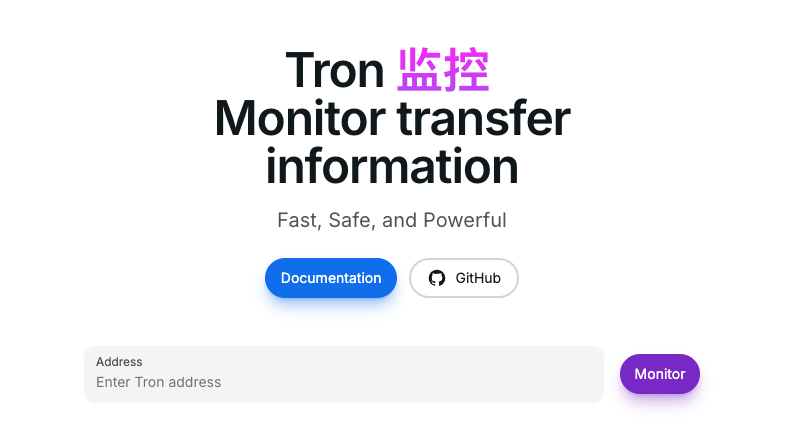

<h1 align="center">Welcome to Tron Monitor 👋</h1>

<p>
  
</p>

> A front-end Tron chain transaction monitoring written in react+NextUI+next.js
> 

## Live Demo

link: [https://tronspan.netlify.app/](https://tronspan.netlify.app/)

## Install

```sh
npm install
```

## Usage

```sh
npm run start
```

## Author

👤 **Tom**

- Website: http://tomcn.uk/

## Show your support

Give a ⭐️ if this project helped you!
